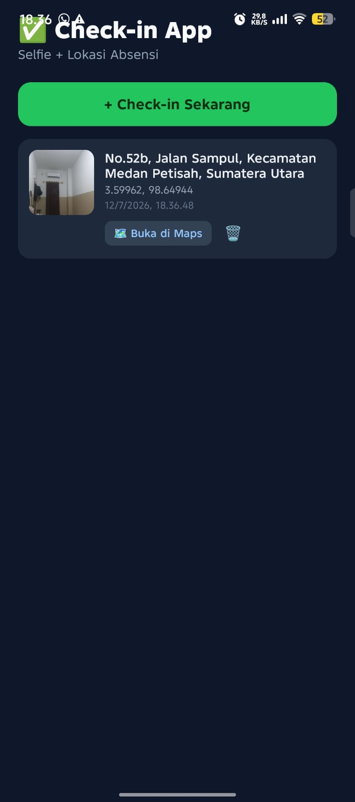
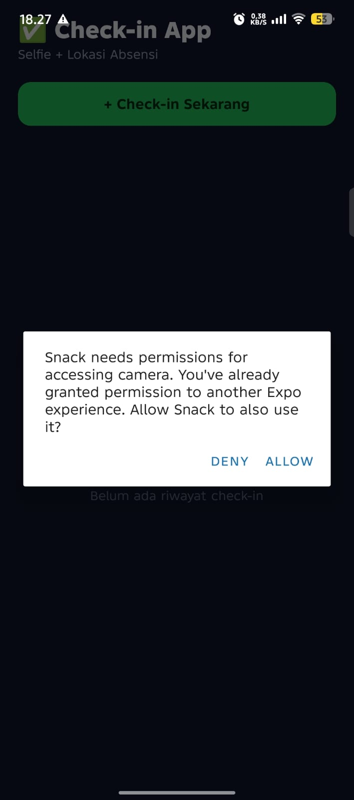
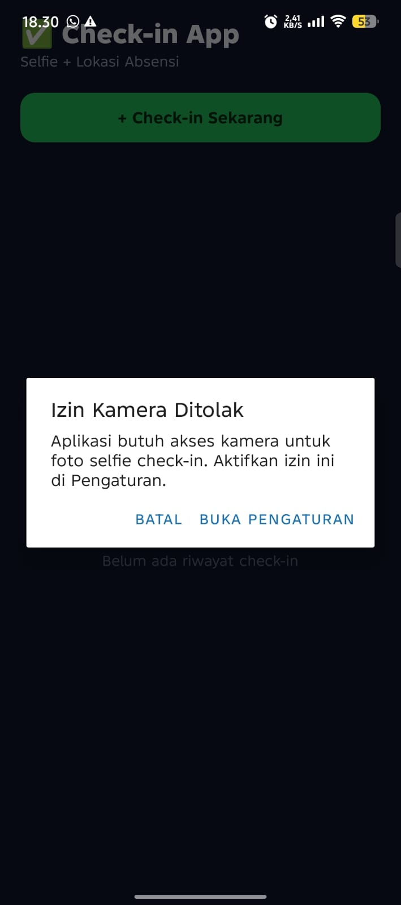

# ✅ Check-in App — Selfie + Lokasi


Aplikasi absensi/check-in berbasis React Native (Expo) yang menggabungkan
**kamera (selfie)** dan **GPS (koordinat lokasi)** dalam satu alur check-in,
lengkap dengan permission flow yang benar, penyimpanan riwayat lokal, dan
tampilan UI modern (gradient, ikon, card statistik).

📦 **Download APK:** `<TEMPEL LINK EAS ARTIFACT DI SINI SETELAH BUILD SELESAI>`
(lihat [RELEASE.md](./RELEASE.md) untuk detail proses build lengkap)

## 📱 Deskripsi

Setiap kali pengguna menekan **"+ Check-in Sekarang"**, aplikasi akan:
1. Menampilkan *priming screen* yang menjelaskan izin yang akan diminta.
2. Meminta pengguna memilih sumber foto (Kamera atau Galeri).
3. Meminta izin kamera/galeri, lalu meminta izin lokasi.
4. Mengambil koordinat GPS saat ini + mengubahnya jadi nama tempat (reverse geocoding).
5. Menyimpan hasil check-in (foto + koordinat + alamat + waktu) ke riwayat.

Riwayat check-in disimpan secara lokal (AsyncStorage) sehingga tetap ada saat
aplikasi ditutup dan dibuka kembali.

## 🔐 Fitur Native yang Dipakai

| Fitur | Modul |
|---|---|
| Kamera & Galeri | `expo-image-picker` |
| Lokasi GPS + Reverse Geocoding | `expo-location` |
| Penyimpanan lokal | `@react-native-async-storage/async-storage` |
| Buka Maps / Pengaturan HP | `Linking` (React Native) |

## 🟢 Level 1 — Fitur Wajib

- [x] Akses kamera/galeri **dan** GPS
- [x] Permission flow: request izin → cek `status === 'granted'` → akses fitur
- [x] Penolakan izin ditangani via `Alert`, tanpa crash
- [x] Cek `result.canceled` sebelum ambil `assets[0].uri`
- [x] Ambil & tampilkan `latitude` / `longitude`
- [x] UI menampilkan hasil foto + koordinat dengan rapi (FlatList)

## 🟡 Level 2 — Fitur Pengembangan (dipilih 4 dari minimal 2)

- [x] **📸 Kamera + Galeri** — Alert pilihan sumber foto sebelum mengambil gambar
- [x] **📍 Kamera + Lokasi** — satu record check-in berisi foto + koordinat sekaligus
- [x] **💾 Persistensi** — riwayat check-in disimpan & dimuat dari AsyncStorage
- [x] **🗺️ Buka di Maps** — tombol di tiap kartu riwayat membuka koordinat di Google Maps
- [x] **🔁 Tombol Settings** — saat izin ditolak, Alert menyediakan tombol ke `Linking.openSettings()`

## 🔴 Level 3 — Bonus

- [x] **Priming screen** sebelum dialog izin sistem muncul
- [x] **Reverse geocoding** — koordinat diubah jadi nama tempat (`Location.reverseGeocodeAsync`)
- [x] **app.json lengkap** — usage description untuk kamera, galeri, dan lokasi (iOS `infoPlist` + Android `permissions`)
- [x] **Hapus foto** — tombol hapus riwayat per item

**Bonus Misi 14:**
- [x] **App Version Display** — versi app (dari `app.json`) tampil di footer UI via `expo-constants`

## 🛠️ Tech Stack

- React Native + Expo SDK 51
- expo-image-picker, expo-location
- @react-native-async-storage/async-storage
- expo-linear-gradient, @expo/vector-icons (UI modern: gradient & ikon)
- JavaScript (functional components + hooks)

## 🚀 Cara Menjalankan

```bash
# 1. Install dependencies
npm install

# 2. Jalankan Expo dev server
npx expo start

# 3. Scan QR code dengan aplikasi Expo Go di HP fisik
#    (pastikan HP & laptop berada di jaringan WiFi yang sama)
```

> **Catatan:** Kamera dan GPS membutuhkan hardware fisik. Jalankan di HP
> asli via Expo Go, bukan di emulator, agar kedua fitur berfungsi penuh.

## 🔗 Expo Snack

`<TEMPEL LINK EXPO SNACK KAMU DI SINI SETELAH DIUPLOAD KE snack.expo.dev>`

## 📸 Screenshot Fitur App

**1. Hasil check-in (foto + koordinat + alamat)**



**2. Dialog permintaan izin sistem**



**3. Penanganan penolakan izin (Alert + tombol Buka Pengaturan)**



## 🚀 Build & Instalasi APK (Misi 14)

App ini sudah dikonfigurasi penuh untuk EAS Build (lihat `app.json` &
`eas.json`), lengkap dengan icon dan splash screen custom bertema
check-in (pin lokasi + kamera + checkmark, warna navy & hijau sesuai brand app).

- 📄 Dokumentasi lengkap langkah build: **[RELEASE.md](./RELEASE.md)**
- 📦 Link download APK: `<TEMPEL LINK EAS ARTIFACT DI SINI>`
- 📱 Package name Android: `com.mahasiswa.checkinapp`

**Screenshot bukti proses build & instalasi:**

| Dashboard EAS (FINISHED) | Dialog Install APK | Icon di Home Screen | App Berjalan Standalone |
|---|---|---|---|
| `<screenshot>` | `<screenshot>` | `<screenshot>` | `<screenshot>` |

> Ganti placeholder di atas dengan gambar dari folder `screenshots/build/`
> setelah kamu selesai menjalankan `eas build`.

## 📁 Struktur Project

```
checkin-app/
├── App.js                    # Seluruh logika UI, permission flow, kamera, GPS, storage
├── app.json                  # Konfigurasi Expo, icon/splash, package name, permissions
├── eas.json                  # Profile build EAS (preview -> APK)
├── babel.config.js
├── package.json
├── assets/
│   ├── icon.png               # 1024x1024 — icon app (custom)
│   ├── adaptive-icon.png      # 1024x1024 — foreground adaptive icon Android
│   └── splash.png             # 1242x1242 — splash screen
├── screenshots/
│   ├── hasil-checkin.jpeg
│   ├── dialog-izin.jpeg
│   ├── penolakan-izin.jpeg
│   └── build/                 # taruh screenshot bukti EAS build & install di sini
├── README.md
└── RELEASE.md                 # dokumentasi proses build & rilis APK
```
